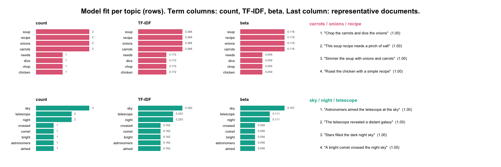

<!-- README.md is generated from README.Rmd. Please edit that file -->

# sbert 

`sbert` computes genuine Sentence-BERT embeddings in R without Python.
Fourteen models are supported, each pinned to an immutable revision and
verified by SHA-256 (`models()` lists them): the classic
`sentence-transformers` family (`all-MiniLM-L6-v2` — the default —
`all-MiniLM-L12-v2`, `paraphrase-MiniLM-L3-v2`,
`multi-qa-MiniLM-L6-cos-v1`, `all-mpnet-base-v2`, and the multilingual
MiniLM/mpnet pair) plus modern embedders: `bge-small-en-v1.5` and
`bge-base-en-v1.5` (CLS pooling), `multilingual-e5-small` (100+
languages), `nomic-embed-text-v1.5` and `jina-embeddings-v2-small-en`
(8,192-token context), and `mxbai-embed-large-v1` (1,024 dimensions).
Hugging Face-compatible tokenization is provided by
[`tok`](https://cran.r-project.org/package=tok), and native model
inference by [`onnxr`](https://cran.r-project.org/package=onnxr).
Embeddings are numerically identical to Python `SentenceTransformers`
output (verified to ~1e-7).

The package never downloads a model or native runtime during
installation, loading, examples, tests, or vignette building. Both
downloads are explicit:

``` r
install.packages("sbert")

library(sbert)
install_runtime()

sentences <- c(
  "A student is reading a research paper.",
  "A learner studies an academic article.",
  "The bicycle is parked beside the building."
)
embeddings <- encode(sentences)
topic_similarity(embeddings)
```

`encode()` uses the default `all-MiniLM-L6-v2` and asks once before its
first download; pick any other pinned model by name
(`encode(sentences, model = "bge-small-en-v1.5")` — see `models()` for
the menu). Loaded models are reused for the whole session. Explicit
`model_download()` / `load_model()` remain available for scripted
installs and backend/thread control.

Semantic topic modeling uses the same native embeddings, deterministic
k-means, representative documents, and class-based TF-IDF terms:

``` r
topic_model <- topics(
  sentences,
  n_topics = 2,
  n_terms = 8
)

topic_model$topics
```

You can run the whole thing with no download by passing a precomputed
embedding matrix. Here two clearly separated groups — cooking and
astronomy — fall out, each labelled by its most distinctive terms:

``` r
sentences <- c(
  "Simmer the soup with onions and carrots",
  "This soup recipe needs a pinch of salt",
  "Chop the carrots and dice the onions",
  "Roast the chicken with a simple recipe",
  "The telescope revealed a distant galaxy",
  "Astronomers aimed the telescope at the sky",
  "A bright comet crossed the night sky",
  "Stars filled the dark night sky"
)
# Two-dimensional stand-in embeddings, so this needs no model download.
embeddings <- rbind(
  c(0.98, 0.02), c(0.95, 0.05), c(0.93, 0.07), c(0.90, 0.10),
  c(0.05, 0.98), c(0.08, 0.95), c(0.10, 0.92), c(0.03, 0.97)
)
topic_model <- topics(sentences, n_topics = 2, embeddings = embeddings)
topic_model$topics
#>   topic                     label n_documents proportion    withinss
#> 1     1 carrots / onions / recipe           4        0.5 0.004327763
#> 2     2   sky / night / telescope           4        0.5 0.003540644
```

`plot(type = "fit")` lays the whole model out at a glance — one row per
topic, its three keyword views (raw count, class-based TF-IDF, and
generative probability) beside its representative documents:

``` r
plot(topic_model, type = "fit")
```



Pass a data frame instead and name the text column: every other column
rides along into `$documents`, and rows whose text is missing, blank, or
a bibliographic placeholder are dropped once rather than by you.

``` r
topic_model <- topics(articles, column = "abstract", n_topics = 40)
```

There is no correct topic count, so choose it from a table rather than
by habit. `compare_topics()` keeps every model it fits, and `fitted()`
takes the one you want without refitting:

``` r
sweep <- compare_topics(text, n_topics = c(10, 20, 30, 40), embeddings = embeddings)
sweep                                    # coherence, diversity, explained
plot(sweep)

topic_model <- fitted(sweep, n_topics = 30)
```

Long documents do not have to be truncated to the encoder's context
window. `segment = "sentence"` (or `"clause"`, `"phrase"`) splits every
document with `segment()` first and fits the topics on the segments, so a
5,000-word report is modelled in full and can span several topics. The
segment options ride along under their `segment()` names, and every
downstream verb knows which document each segment came from:

``` r
topic_model <- topics(
  reports,
  n_topics = 10,
  segment = "sentence",
  max_tokens = 200,          # cap by the model's own tokenizer
  min_content = 0.5          # drop numeral-only and citation fragments
)

topic_sizes(topic_model, by = "document")   # documents per topic, not segments
topic_gamma(topic_model)                    # each document's topic mixture, no re-encoding
representatives(topic_model)                # segments, with document_id and segment
predict(topic_model, new_reports)           # new text is segmented the same way
```

Not sure which unit suits the corpus? Compare them the same way you compare
counts: several levels in one call give one table with a `segment` column and
one plot with a line per level, and `fitted()` takes both choices.

``` r
comparison <- compare_topics(
  reports,
  n_topics = c(6, 8, 10, 12),
  segment = c("document", "sentence", "clause")
)
plot(comparison)
topic_model <- fitted(comparison, n_topics = 8, segment = "sentence")
```

Topic terms depend only on the fitted assignments and the text, so every
term setting can be retuned without repeating the clustering or the
encoding:

``` r
terms(topic_model, n = 12)                       # distinctive terms (c-TF-IDF)
terms(topic_model, n = 12, sort_by = "beta")     # the words a topic uses most
terms(topic_model, n = 12, weighting = "bm25", stem = TRUE)
```

Cleaning happens at two levels, kept deliberately separate. **Token
filters** tidy the *labels* without touching the text or its embedding:
`numbers`, `roman_numerals`, and `section_numbers` (each `"keep"` or
`"remove"`) drop bare years, chapter numerals, and indices such as
`1.2.3` from the topic terms only, so a number still shapes the
embedding while staying out of a cluttered label.

``` r
topics(text, n_topics = 30, embeddings = embeddings,
       numbers = "remove", roman_numerals = "remove", section_numbers = "remove")
```

**`clean_corpus()`** cleans the *source text* before encoding —
repairing junk characters, stripping list markers and reference
numbering, and dropping whole low-content units (citation lists,
reference footnotes) by their alphabetic density. Because Sentence-BERT
is robust to a little noise, this is about fixing genuinely broken text
and removing non-content rows, not scrubbing every token. Clean once,
then encode the result:

``` r
docs <- clean_corpus(raw_text, min_content = 0.5)   # or a data frame + column =
embeddings <- encode(docs)
topics(docs, n_topics = 30, embeddings = embeddings)
```

Fitted topic models support a full inferential layer — assignment of new
documents, soft membership, generative word probabilities, and
mixed-topic document distributions:

``` r
predict(topic_model, new_sentences)   # nearest-centroid topics
topic_membership(topic_model)         # fuzzy topic probabilities
terms(topic_model)                    # ranked terms + p(term | topic)
topic_gamma(topic_model, sentences)   # per-document topic mixture
```

Beyond the curated registry, `load_custom()` loads any public Hugging
Face repository with an ONNX encoder export, auto-detecting its
configuration and pinning it locally on first use (“trust on first
use”):

``` r
gte <- load_custom("thenlper/gte-small")
encode(sentences, gte)
```

Multilingual corpora use the same API with a multilingual model:

``` r
model_download("paraphrase-multilingual-MiniLM-L12-v2")
multilingual <- load_model("paraphrase-multilingual-MiniLM-L12-v2")
embeddings <- encode(head(feedback_translations$feedback, 100), multilingual)
```

`n_topics` is deliberately explicit: the package does not silently guess
a topic count. You may also pass a precomputed embedding matrix through
the `embeddings` argument for reproducible offline analysis.

Every topic solution can be evaluated and visualized without any further
model call:

``` r
coherence(topic_model, measure = "npmi")  # per-topic UMass / NPMI coherence
topic_diversity(topic_model)              # distinct-vocabulary proportion
summary(topic_model)                      # scientific report + quality table

plot(topic_model, type = "sizes")         # documents per topic
plot(topic_model, type = "terms")         # top class-based TF-IDF terms
plot(topic_model, type = "map")           # classical-MDS document map
```

Term weighting supports the class-based TF-IDF, BM25
(`weighting = "bm25"`), and square-root (`reduce_frequent_words = TRUE`)
schemes of Mendonca and Figueira (2025).

For very large corpora there is an instant-speed tier: `potion-base-8M`
is a static (Model2Vec) model whose encoding is a token lookup and mean
in pure base R — around 10,000 sentences per second, no ONNX involved,
with the same pinning, verification, and verbs as every other model:

``` r
model_download("potion-base-8M")   # 30 MB
fast <- load_model("potion-base-8M")
embeddings <- encode(text, model = fast)
```

Topic models can be guided: name your topics and seed them with words or
descriptions, and the seeds become the first centroids — initialization
only by default, frozen with `fixed_seeds = TRUE` (zero-shot
assignment):

``` r
topics(
  text,
  n_topics = 10,
  seeds = c(
    motivation = "student motivation and engagement",
    assessment = "grading feedback and assessment"
  )
)
```

Around the topic model, a few utilities cover the everyday analysis
moves:

``` r
keywords(text, n = 5)                                 # embedding-ranked keywords (MMR)
stop_words(add = c("students", "learning"))           # exclude corpus vocabulary
compare_topics(text, n_topics = c(10, 20, 30), embeddings = embeddings)
tree <- topic_hierarchy(topic_model)                  # which topics are neighbours?
plot(tree)                                            # labeled dendrogram
smaller <- reduce_topics(topic_model, n_topics = 12)  # merge down, keep all verbs
```

Documents can be split into sentences, clauses, or phrases before
embedding, entirely offline and deterministically:

``` r
segment(
  "We had two goals: speed and clarity; both were met. See Fig. 3.",
  level = "clause"
)
#>   document_id document_name segment               text
#> 1           1                     1  We had two goals:
#> 2           1                     2 speed and clarity;
#> 3           1                     3     both were met.
#> 4           1                     4        See Fig. 3.
```

`segment()` returns one row per segment with the source document index,
guarding abbreviations (`abbreviations()`), decimals, and parentheticals
so they never end a sentence. The clause level (the default) also splits
at subordinating hinges while keeping comma enumerations whole.
`max_tokens` caps segment length so nothing overruns an encoder’s
context window — an over-long segment is re-split at the finest
punctuation first, and only word-chopped as a last resort; pass
`model =` to count that model’s exact tokens.

``` r
segment(long_documents, level = "sentence", max_tokens = 256, model = model)
```

Segments can carry their document’s context into the embedding:
`blend()` keeps `alpha` of each segment’s context-orthogonal residual
and inherits the rest from the parent document vector, so a sentence
that is ambiguous in isolation embeds near its document’s subject while
keeping what it alone says. The result drops into `topics()` and
`representatives()` unchanged:

``` r
sentences <- segment(abstracts, level = "sentence")
embeddings <- blend(sentences, abstracts, alpha = 0.5)
```

The bundled `feedback_translations` dataset (8,757 multilingual
AI-generated mathematics feedback messages from the Levebee educational
application, with English translations) provides a realistic corpus for
trying the full workflow offline:

``` r
head(feedback_translations)
#>                                                       feedback
#> 1                                Víš, co znamená o jeden více?
#> 2                   V červeném má být o dva více než v modrém.
#> 3                     Když to není člověk, tak co to může být?
#> 4                                Co znamená všechny za prvním?
#> 5 V šedém rámečku je pět obrázků. Kde je o jeden obrázek méně?
#> 6                              Podle čeho se obrázky střídají?
#>                                                                 translation
#> 1                                        Do you know what “one more” means?
#> 2                     There should be two more in the red than in the blue.
#> 3                                   If it’s not a person, what could it be?
#> 4                            What does “everyone after the first one” mean?
#> 5 There are five pictures in the gray box. Where is there one picture less?
#> 6                                            How do the pictures alternate?
```

A second dataset, `covid`, holds 4,170 COVID-19 research abstracts
(2020-2024) with publication years — a longer, more technical corpus for
topic modeling and temporal analysis, showcased in the “Topic Modeling
COVID-19 Research Abstracts” article.

Model downloads range from 31 MB (`potion-base-8M`) to 1.3 GB
(`mxbai-embed-large-v1`) and are stored under the platform-specific path
returned by `cache_dir()`. Every artifact is verified by byte size and
SHA-256 before it is used.

## Tutorial

A full worked tutorial ships with the package and runs offline on the
bundled `feedback_translations` data — building a six-topic model,
checking its coherence and diversity, reading each topic through two
keyword views, and confirming the labels with representative messages:

``` r
vignette("levebee_vignette", package = "sbert")
```

## Supported scope

- Models: fourteen pinned models (see `models()`), classic and modern,
  English and multilingual, 256 to 1,024 dimensions, 128 to 8,192
  tokens, 31 MB to 1.3 GB
- Pooling: attention-mask-aware mean pooling or CLS pooling, per model
- Prefixes: model-pinned input prefixes applied automatically (E5,
  Nomic)
- Custom models: `load_custom()` for any HF ONNX encoder repository,
  with trust-on-first-use local pinning
- Tokenization: each model’s official `tokenizer.json`, truncated to the
  model’s published maximum sequence length
- Static models: `potion-base-8M`, a pure-R Model2Vec token-lookup
  embedder with no ONNX Runtime dependency
- Normalization: row-wise L2 normalization by default
- Segmentation: deterministic sentence, clause, and phrase splitting
  with an abbreviation gazetteer and decimal/parenthetical guards
- Corpus cleaning: `clean_corpus()` repairs junk characters, strips list
  and reference numbering, and drops low-content units by alphabetic
  density
- Topic discovery: deterministic k-means with farthest-point
  initialization
- Topic descriptions: representative documents and BERTopic-style
  c-TF-IDF
- Topic inference: `predict()` for new documents, fuzzy soft membership,
  generative `beta`, and segment-based document-topic `gamma`
- Topic evaluation: intrinsic UMass and NPMI coherence, and topic
  diversity
- Topic visualization: deterministic base-graphics views — topic sizes,
  term bars, representative documents, a per-topic fit report, and an
  MDS document map
- Backends: those exposed by `onnxr`, with CPU as the portable default

Arbitrary unpinned Hugging Face models and training/fine-tuning are
intentionally out of scope.
