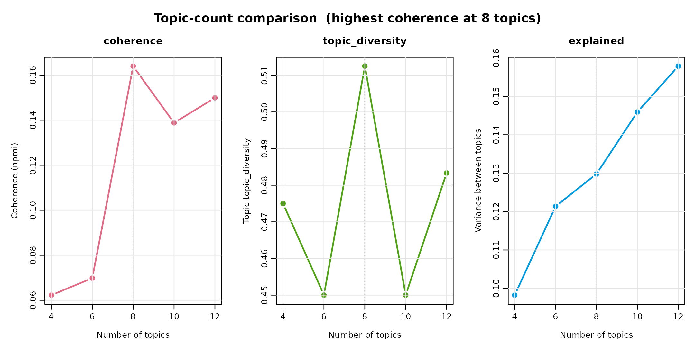
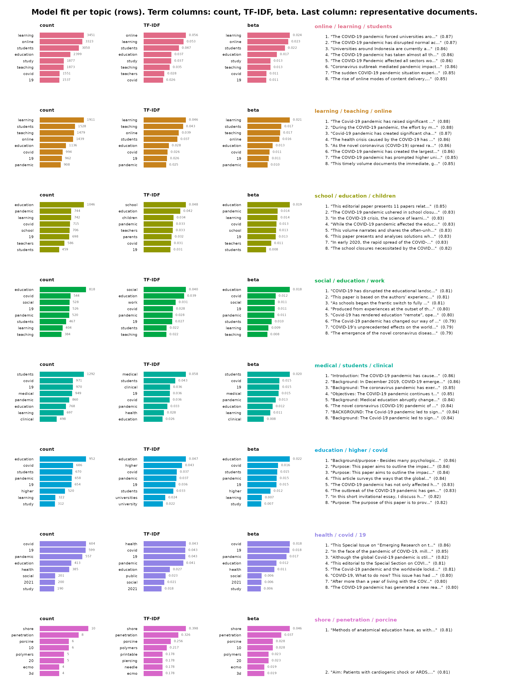
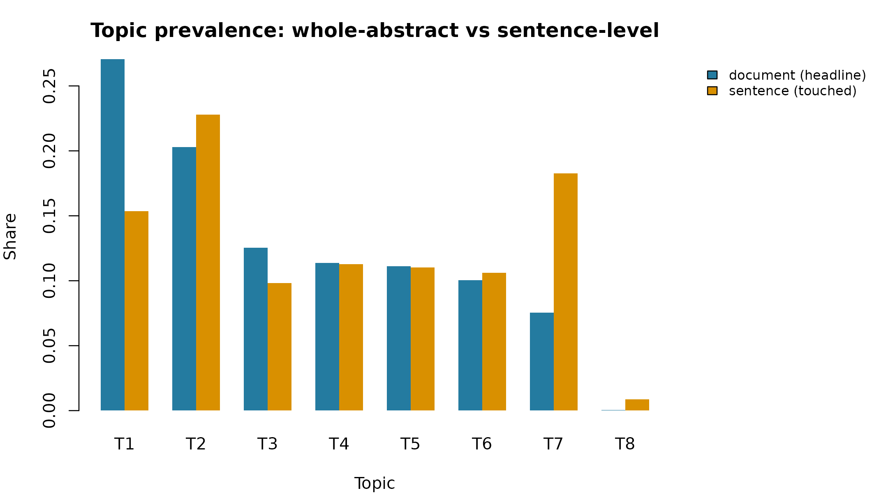
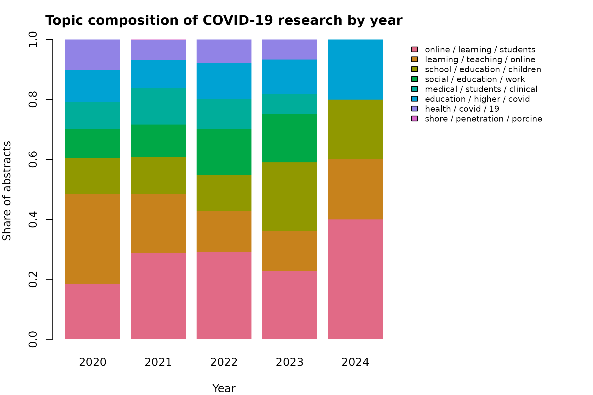

# Topic Modeling COVID-19 Research Abstracts

The bundled `covid` dataset holds abstracts of COVID-19 research on
education, children, schools, and society. This review embeds every
abstract with a Sentence-BERT model, groups them into semantic topics,
and reads the result — including how the mix of topics shifted across
the pandemic years. Everything is deterministic: rerunning reproduces
every number and figure.

## Building the model

Drop the records indexed without an abstract.

``` r

covid_content <- covid[covid$Abstract != "[No abstract available]", ]
```

[`encode()`](https://sonsoles.me/sbert/reference/encode.md) turns each
abstract into a 384-dimensional vector with the pinned default model,
`all-MiniLM-L6-v2`. Abstracts longer than the model’s 256-token window
are truncated to their opening; for full-length documents a long-context
model such as `nomic-embed-text-v1.5` (8,192 tokens) is a drop-in
replacement.

``` r

install_runtime()
model_download()

embeddings <- encode(covid_content$Abstract, batch_size = 32)
```

There is no correct topic count.
[`select_topics()`](https://sonsoles.me/sbert/reference/select_topics.md)
fits one model per candidate and reports the numbers that justify a
choice:

``` r

sweep <- select_topics(
  covid_content$Abstract,
  n_topics = c(4, 6, 8, 10, 12),
  embeddings = embeddings,
  measure = "npmi"
)
sweep
#> <sbert_topic_sweep> 5 candidates, coherence measure: npmi
#>  n_topics  coherence topic_diversity  explained
#>         4 0.06228923       0.4750000 0.09824599
#>         6 0.06981488       0.4500000 0.12136775
#>         8 0.16400373       0.5125000 0.12979221
#>        10 0.13881058       0.4500000 0.14591512
#>        12 0.14991624       0.4833333 0.15786363
#> 
#> Fitted models retained: fitted(x, n_topics = 8)
```

``` r

plot(sweep)
```



Coherence climbs from four topics to a clear peak at **eight** and falls
off on either side; topic diversity peaks there too, even as `explained`
keeps rising with the count. Eight is therefore the granularity this
corpus actually supports — the point after which adding topics stops
improving coherence.

``` r

topic_model <- fitted(sweep, n_topics = 8)
```

## Corpus at a glance

4,170

Records

3,847

Modeled abstracts

3,670

Distinct

2020-2024

Years

8

Topics

**Read the topics as a lens, not a taxonomy.** Eight was chosen because
coherence peaks there, not because it is uniquely correct. Labels are
the three most distinctive class-based TF-IDF terms, not validated
names. A bibliographic export is never perfectly on-theme, so one small
cluster collects genuinely off-topic papers (veterinary and materials
research) — the model isolating them rather than contaminating the
education topics.

## The topics

| Topic | Distinctive terms             | Abstracts | Share |
|------:|:------------------------------|----------:|:------|
|     1 | online / learning / students  |      1041 | 27.1% |
|     2 | learning / teaching / online  |       780 | 20.3% |
|     3 | school / education / children |       483 | 12.6% |
|     4 | social / education / work     |       437 | 11.4% |
|     5 | medical / students / clinical |       428 | 11.1% |
|     6 | education / higher / covid    |       386 | 10.0% |
|     7 | health / covid / 19           |       290 | 7.5%  |
|     8 | shore / penetration / porcine |         2 | 0.1%  |

`plot(type = "fit")` lays out all eight topics at once — the three
keyword views (raw within-topic count, class-based TF-IDF, and
generative probability) beside each topic’s representative abstracts,
one row per topic:

``` r

plot(topic_model, type = "fit", n_terms = 8, n_representatives = 8)
```



The cards below give the same evidence topic by topic, with the full
abstracts in collapsible panels — the auditable proof that a label means
what it claims.

#### Topic 1 — online / learning / students

1,041 abstracts · 27.1% of the corpus

**Distinctive terms:** online, learning, students, education, study,
teaching, teachers, covid

Nearest abstract 1 - 2021 (distance 0.255)

Covid-19 has forced educators to switch to online teaching as the only
viable option, whether through video lecturing or using other online
teaching tools. Therefore, the study investigates university teachers’
perceptions towards their continuing intention of using the online
platforms after Covid19 situations. To answer such questions, the
present study conducted a survey of 242 faculties engaged in higher
education teaching at assistant. We have conducted the present study
using a sample of 242 faculties. Based on the framework of technology
adoption model (TAM), this study investigates the research questions in
the context of India. The study has adopted a mixed-method research
design c…

Nearest abstract 2 - 2022 (distance 0.266)

This study examines the current state of acceptance of online classes
using the technology acceptance model. The background of the study is
the turning point in Korean education in response to the COVID-19
pandemic and speculation about changes in the post-COVID educational
environment. To measure the acceptance rate of online classes, a survey
was conducted on a total of 313 university students taking online
classes. The data were analyzed using structural equation modeling. The
results of the study are as follows: First, the perceived ease of use of
online classes showed a positive effect on perceived usefulness. Second,
both the perceived ease of use and usefulness of online classes show…

Nearest abstract 3 - 2022 (distance 0.235)

The COVID-19 pandemic has disrupted existing educational systems
worldwide. Due to lockdowns in several countries, the educational
institutions have been directed by governments to move towards online
learning. The challenge for educational institutions and faculty members
is to assess the influence of various factors that would enable adoption
of online learning by students in higher education. This study
investigates the influence of awareness of COVID-19 (AOC19), computer &
internet self-efficacy (CISE), and online communication self-efficacy
(OCSE) on perceived net benefits (NB) of the students and their
intention towards the online learning (INT). The study further analyzes
the mediati…

#### Topic 2 — learning / teaching / online

780 abstracts · 20.3% of the corpus

**Distinctive terms:** learning, teaching, online, students, education,
covid, 19, pandemic

Nearest abstract 1 - 2020 (distance 0.354)

General chemistry, CHE 101, at Hampton University is an undergraduate
course designed to meet curriculum requirements for nonscience majors.
The four-credit course consists of a lecture and a laboratory, taken
concurrently. The lecture consists of three 50 minute or two 75 minute
sessions, and the laboratory consists of one 3 hour session every week.
The first 8 weeks of the 2020 spring semester were taught face-To-face
(F2F), but this changed to remote teaching and learning for the
remainder of the semester because of COVID-19. The university canceled
F2F teaching in mid-March, and the students went home with the
instructions that remote teaching would commence the following week. In
the m…

Nearest abstract 2 - 2020 (distance 0.326)

The transition to a remote teaching and learning environment was quick
and painful at times, and yet it was a learning experience for everyone.
The chemists at Centre College utilized new (to them) technology to
reimagine the typical face to face interactions with students and
colleagues. From Slack to Pear Deck to Zoom classrooms, the faculty and
students engaged with a variety of platforms to continue to learn
remotely despite the challenges of the global pandemic. The faculty
learned the value of utilizing different types of technology, and the
students learned some important skills and content. © 2020 American
Chemical Society and Division of Chemical Education, Inc.

Nearest abstract 3 - 2020 (distance 0.363)

Today’s engineering laboratory education often lacks opportunities for
students to practice critical thinking through real-world problems. This
particular objective is even harder to achieve through online laboratory
experiments. In this article, we summarize our innovation in using a
real-world challenge, analyze big data, to empower student data analysis
skills in remote teaching platform. This approach allows students to
collect data, analyze, and evaluate possible solutions continuously
through hands-on experimentation with accessible resources around them.
Compared to the video-recorded lab, our method achieves a higher level
of learning in Bloom’s taxonomy. To further improve our appr…

#### Topic 3 — school / education / children

483 abstracts · 12.6% of the corpus

**Distinctive terms:** school, education, children, pandemic, teachers,
parents, covid, 19

Nearest abstract 1 - 2021 (distance 0.344)

This study reports the results of a survey conducted with a set of
“hybrid homeschool”leaders (principals or directors) from around the
United States who were asked to describe 1. how their families
categorize themselves (as homeschoolers, or as members of private
schools), 2. the ways in which their schools operate in terms of
scheduling, hiring, etc., 3. how their schools are regulated in the
various states, and how they work within those regulatory frameworks,
and 4. how they were affected by COVID-19, both in the spring of 2020
and the fall of 2020. Respondents provided a variety of names to
describe their schools and a split in how families see themselves. In
terms of staffing, schedul…

Nearest abstract 2 - 2021 (distance 0.418)

The aim of the present study is to describe how parents and primary
school children dealt with the rapid and significant changes to their
schooling experience during COVID-19 and how this correlated with
children’s mental health. A cross-sectional study comprising an online
survey was completed by 797 parents of children from 4–12 years, (M = 9
years). School variables explored included school expectations for
schoolwork, how much time per day spent on schoolwork, how able parents
were to support their child with schoolwork, whether a child had support
from an adult at school and whether the child had support from a friend.
Child mental health was measured by the Strengths and Difficulties …

Nearest abstract 3 - 2020 (distance 0.263)

Parents of children with special educational needs and disabilities
(SEND) took part in an online survey that explored their experiences of
home-schooling during the coronavirus pandemic. Two hundred and
thirty-eight parents from the UK responded to 49 questions about the
resources and support they had received, their management and feelings
surrounding home-schooling. Chi-square analyses were used to establish
whether parents’ experiences differed as a result of socio-economic
status (SES) or the nature of their child’s SEND. Results indicated that
parents were dissatisfied with the resources and support they had
received for their child’s educational and psychological needs. Parents
felt …

#### Topic 4 — social / education / work

437 abstracts · 11.4% of the corpus

**Distinctive terms:** social, education, work, covid, pandemic, 19,
students, teaching

Nearest abstract 1 - 2021 (distance 0.364)

It took a global pandemic for me to recognize how my social work
teaching was an act of feminist praxis. I have long identified as a
feminist and regularly engage efforts to advance equity for women,
primarily centered on the abolition of prisons which disproportionately
incarcerate Indigenous and Black women in Canada. Surprisingly, I have
never considered how my feminism shows up in my teaching. The following
reflexive essay explores the ways in which the feminist principles of
centring emotions, rejecting patriarchal hierarchy, and challenging
white feminism were embedded into the development and delivery of a
graduate level social work research course that was rapidly adapted to
being t…

Nearest abstract 2 - 2021 (distance 0.364)

It took a global pandemic for me to recognize how my social work
teaching was an act of feminist praxis. I have long identified as a
feminist and regularly engage efforts to advance equity for women,
primarily centered on the abolition of prisons which disproportionately
incarcerate Indigenous and Black women in Canada. Surprisingly, I have
never considered how my feminism shows up in my teaching. The following
reflexive essay explores the ways in which the feminist principles of
centring emotions, rejecting patriarchal hierarchy, and challenging
white feminism were embedded into the development and delivery of a
graduate level social work research course that was rapidly adapted to
being t…

Nearest abstract 3 - 2021 (distance 0.453)

In this chapter, I trace instances of meaning-making through fragments
of two interviews. Using restorying and the construction of parallel
stories to interpret resonances across the participants’ stories and my
own stories of experience, I draw strong personal connections with
elements of each semi-structured interview. In a revisitation of the
narrative threads of identity, community, and change, the image of Black
women as literacy educators who co-construct meaning in and out of the
classroom is rendered. © 2021 by Emerald Publishing Limited.

#### Topic 5 — medical / students / clinical

428 abstracts · 11.1% of the corpus

**Distinctive terms:** medical, students, clinical, 19, covid, pandemic,
health, education

Nearest abstract 1 - 2021 (distance 0.309)

Objective: Describe the early impact of the COVID-19 pandemic on general
surgery residency training nationwide. Design: A 31-question electronic
survey was distributed to general surgery program directors. Qualitative
data underwent iterative coding analysis. Quantitative data were
evaluated with summary statistics and bivariate analyses. Participants:
Eighty-four residency programs (33.6% response rate) with representation
across US geographic regions, program affiliations, and sizes. Results:
Widespread changes were observed in the surgical training environment.
One hundred percent of programs reduced the number of residents on
rounds and 95.2% reduced the size of their in-hospital reside…

Nearest abstract 2 - 2021 (distance 0.309)

Objective: Describe the early impact of the COVID-19 pandemic on general
surgery residency training nationwide. Design: A 31-question electronic
survey was distributed to general surgery program directors. Qualitative
data underwent iterative coding analysis. Quantitative data were
evaluated with summary statistics and bivariate analyses. Participants:
Eighty-four residency programs (33.6% response rate) with representation
across US geographic regions, program affiliations, and sizes. Results:
Widespread changes were observed in the surgical training environment.
One hundred percent of programs reduced the number of residents on
rounds and 95.2% reduced the size of their in-hospital reside…

Nearest abstract 3 - 2021 (distance 0.374)

Objective: The COVID-19 pandemic has drastically transformed the
healthcare community and medical education across the United States. The
aim of this study was to evaluate the impact of COVID-19 on the surgical
resident training experience, assess possible sources of stress or
anxiety among surgery residents, and examine how patterns of anxiety
vary by resident rank. Design: We developed and disseminated a survey,
which included the Generalized Anxiety Disorder 7-Item Scale (GAD-7), to
all general and integrated plastic surgery residents in their clinical
years of training at the University of California, San Francisco.
Statistical analysis of the survey responses was performed using the Kr…

#### Topic 6 — education / higher / covid

386 abstracts · 10.0% of the corpus

**Distinctive terms:** education, higher, covid, pandemic, 19, students,
universities, university

Nearest abstract 1 - 2022 (distance 0.211)

Worldwide, COVID-19 affected higher education, including finance, and
international mobility. But some systems have been more affected than
others; notably Anglophone systems that have been a preferred
destination for a high proportion of international students. Australia
presents a particularly interesting case. Particularly vulnerable to any
significant downturn in international enrolments, given its high
proportion of international students, and heavy dependence on their
fees, the problem was exacerbated by growing US–China tensions, and
resultant pressures on Australia and its universities. Culture Wars were
also evident in the steadfast refusal of the national government to
offer much …

Nearest abstract 2 - 2021 (distance 0.382)

The market shock that accompanied COVID-19 has the potential to
significantly transform higher education. At the same time, it presents
an opportunity for higher education to learn from industry and adopt
successful policies and practices. This paper provides lessons learned
from the oil industry which may help higher education institutions to
successfully navigate disruption and improve organizational outcomes. A
four-phase business cycle model is presented as a strategic corollary
for industry and higher education to support decision-making and provide
a mechanism for discussion and policy development. © The Author(s) 2020.

Nearest abstract 3 - 2020 (distance 0.300)

Universities UK (UUK) has suggested that there may be very significant
losses to higher education as a consequence of Covid-19. However, losses
are likely to be substantially lower than the potential losses estimated
by UUK. But the magnitude of losses is very uncertain. The UUK’s
proposal to restrict undergraduate enrolment per university to stop
institutions poaching students is not in the interests of the most
highly regarded universities, or that of students. Some rationalisation
of the sector should be the price of further government support. Now is
also the time to reconsider how university research is funded. © 2020.
Political Quarterly Publishing Co (PQPC)

#### Topic 7 — health / covid / 19

290 abstracts · 7.5% of the corpus

**Distinctive terms:** health, covid, 19, pandemic, education, public,
social, 2021

Nearest abstract 1 - 2021 (distance 0.329)

Severe Acute Respiratory Syndrome Coronavirus 2 (SARS-CoV-2) or COVID-19
has undeniably changed the world forever. Capitalism in the United
States and Europe can no longer feel immune from the effects of
epidemics that were at one point in time the concern of minor countries,
such as the recent (2014-2016) Ebola epidemic in Western Africa. This
article examines how COVID-19 not only showed that Capitalism has no
clothes in its inability to respond effectively to this momentous event,
but shows the burgeoning of the impact on its slow-motion decline. This
is evident from the still-unresolved healthcare crisis in the United
States, which allows runaway contagion, sickness, and death due to a …

Nearest abstract 2 - 2021 (distance 0.190)

This editorial to the Special Section on COVID-19 emphasises the
importance of researching pandemic realities and the value that the
findings can bring to the way we shape decisions in the future, for the
‘new normal’. The pandemic, with its rapidly changing timeline, required
swift action in untrialled circumstances and its consequences have been
experienced differently by diverse institutions and across national
contexts. Depending on the roles and responsibilities we may have taken
on during this time, our capabilities to document our experiences and
emerging trends have varied. © University of Deusto.

Nearest abstract 3 - 2021 (distance 0.298)

Humanity has been on its way accompanied by epidemics, as man has
evolved, he has faced different problems that have affected most of
society. In the last 50 years, more viruses have appeared that have
affected different regions and multiple countries; but one of the most
distributed worldwide is COVID-19. The objective is to offer some
information related to this pandemic and its evolution in different
countries. The bibliographic review method was used even though some
bibliographies are very recent, but it has allowed us to know their
behavior and follow-up. The results of the countries most affected by
this pandemic are shown, where it could be said that Italy has
increasingly affected …

#### Topic 8 — shore / penetration / porcine

2 abstracts · 0.1% of the corpus

**Distinctive terms:** shore, penetration, porcine, polymers, ecmo,
needle, piercing, printable

Nearest abstract 1 - 2021 (distance 0.185)

Aim: Patients with cardiogenic shock or ARDS, for example, in
COVID-19/SARS-CoV-2, may require extracorporeal membrane oxygenation
(ECMO). An ECLS/ECMO model simulating challenging vascular anatomy is
desirable for cannula insertion training purposes. We assessed the
ability of various 3D-printable materials to mimic the penetration
properties of human tissue by using porcine aortae. Methods: A test
bench for needle penetration and piercing in sampled porcine aorta and
preselected 3D-printable polymers was assembled. The 3D-printable
materials had Shore A hardness of 10, 20, and 50. 17G Vygon 1.0 × 1.4 mm
× 70 mm needles were used for penetration tests. Results: For the
porcine tissue and S…

Nearest abstract 2 - 2021 (distance 0.185)

Methods of anatomical education have, as with many facets of normal
life, been forced to evolve rapidly due to the Covid-19 pandemic. Whilst
some authors claim that cadaver dissection is now under threat, we
believe the centuries-old practice can and must be upheld. © 2020 The
Author(s). Published by Informa UK Limited, trading as Taylor & Francis
Group.

## What each paper touches

The document model gives each abstract a single label — its dominant
theme. A long abstract usually spans several topics, though, and unlike
the whole-abstract embedding, its individual sentences are short enough
to escape the 256-token truncation.
[`segment()`](https://sonsoles.me/sbert/reference/segment.md) splits a
document into sentences, deterministically:

``` r

segment(covid_content$Abstract[1], level = "sentence")
#>    document_id document_name segment
#> 1            1                     1
#> 2            1                     2
#> 3            1                     3
#> 4            1                     4
#> 5            1                     5
#> 6            1                     6
#> 7            1                     7
#> 8            1                     8
#> 9            1                     9
#> 10           1                    10
#>                                                                                                                                                                                                                                                                              text
#> 1                                                                                         The COVID-19 Pandemic and resulting school closures, present a serious threat to young children's care, learning, and the achievement of their developmental potential (UNESCO, 2020a).
#> 2                                    Disruptions to normal school functioning worldwide have presented challenges for teachers who were generally unprepared to teach using different methodologies (United Nations in Policy brief: Education during Covid-19 and beyond, 2020).
#> 3  Since a child's right to care and education extends even during emergencies this study was conceptualized to better understand the professional experiences of early childhood teachers as they navigated the teaching learning process during the COVID-19 school disruption.
#> 4                                      A multiple site qualitative case study was designed to answer two research questions: What were the professional experiences of Caribbean Early Childhood Care and Education (ECCE) teachers at the start of the COVID-19 pandemic period?
#> 5                                                                                                                                                                        And how did Caribbean ECCE teachers adapt to ensure continuity of children's rights to access education?
#> 6                                                                                                                                        Almog and Perry-Hazan's (2012) conceptualisation of the Right to Adaptable Education provided the theoretical foundation for this study.
#> 7                                                                                                                                                                                      Data were collected using a questionnaire sent to teachers from seven Caribbean countries.
#> 8                                                               Five themes were extricated from the findings: changed teacher experiences, significant new understandings, changed teacher collaboration practices, changed individual qualities, and warning signs for support.
#> 9                                                                                                                                                               We conclude by making recommendations for macro level support for the ECCE sector during educational disruptions.
#> 10                                                                                                                                                                                                         © 2022, The Author(s), under exclusive licence to Springer Nature B.V.
```

[`topic_gamma()`](https://sonsoles.me/sbert/reference/topic_gamma.md)
does this across the corpus — assigning every sentence to its nearest
topic and returning each abstract’s topic *mixture* (`gamma` sums to 1
within a document):

``` r

gamma <- topic_gamma(topic_model, covid_content$Abstract, level = "sentence")
head(gamma)
#>   document_id topic gamma n_segments
#> 1           1     1   0.0         10
#> 2           1     2   0.0         10
#> 3           1     3   0.7         10
#> 4           1     4   0.2         10
#> 5           1     5   0.0         10
#> 6           1     6   0.0         10
```

Most abstracts touch several topics. One that spreads across the most,
with the share of its sentences on each:

| Topic                         | Share of sentences |
|:------------------------------|:-------------------|
| learning / teaching / online  | 33%                |
| online / learning / students  | 11%                |
| school / education / children | 11%                |
| social / education / work     | 11%                |
| medical / students / clinical | 11%                |
| education / higher / covid    | 11%                |
| shore / penetration / porcine | 11%                |

Aggregating every sentence gives a second view of prevalence — the share
of *sentences* on each topic — next to the document-level share. The two
agree on the big themes but diverge on the secondary ones: a topic that
is rarely a paper’s headline can still run through many papers’
sentences.



A topic model of whole abstracts reports each paper’s *headline*; the
sentence view shows everything it *touches* — and because sentences are
never truncated, it reaches content the 256-token window cuts off.

## Topics across the pandemic

Because every abstract carries a publication year, the model doubles as
a lens on how the research conversation moved. The share of each year’s
abstracts assigned to each topic:



Each bar is one year; the coloured segments are the topics’ shares that
year. Reading left to right shows which strands of the education
literature grew and which faded as the pandemic wore on.

**Reusing the model.**
[`predict()`](https://rdrr.io/r/stats/predict.html) assigns new
abstracts to these topics without refitting, and
[`topic_membership()`](https://sonsoles.me/sbert/reference/topic_membership.md)
gives graded probabilities when an abstract sits between topics. For
long abstracts,
[`segment()`](https://sonsoles.me/sbert/reference/segment.md) splits
each into sentences and
[`blend()`](https://sonsoles.me/sbert/reference/blend.md) carries the
paper’s context into every sentence’s embedding, so a sentence that is
ambiguous alone still embeds near its subject.
