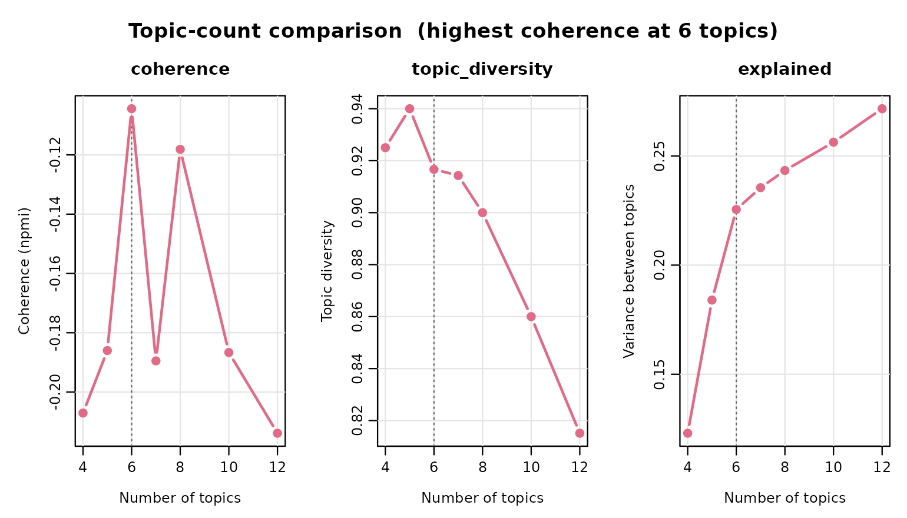
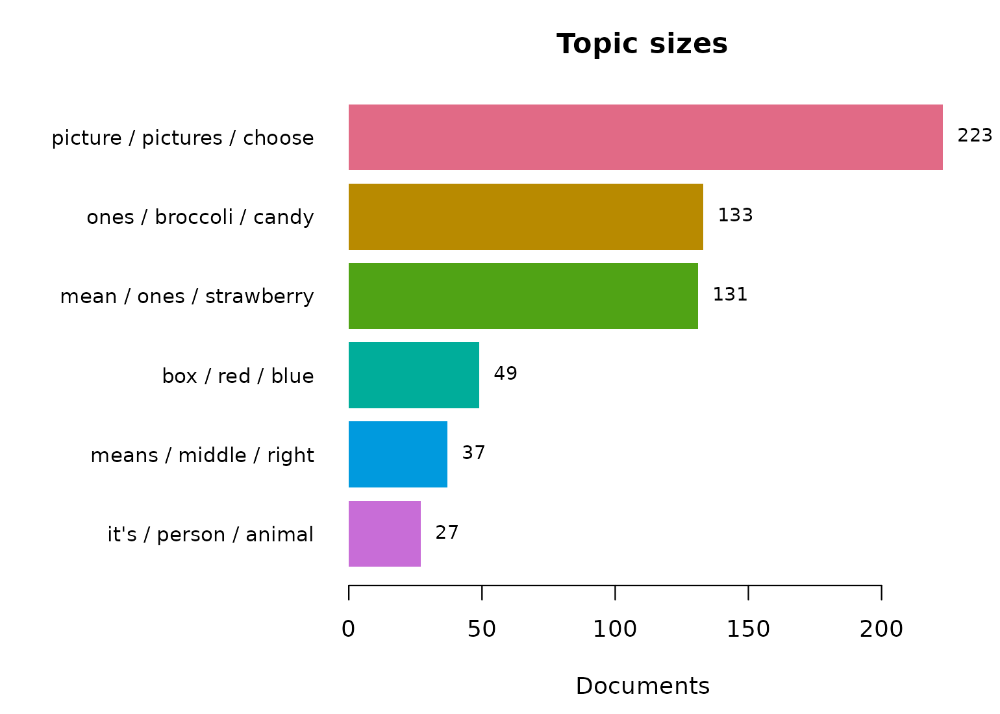
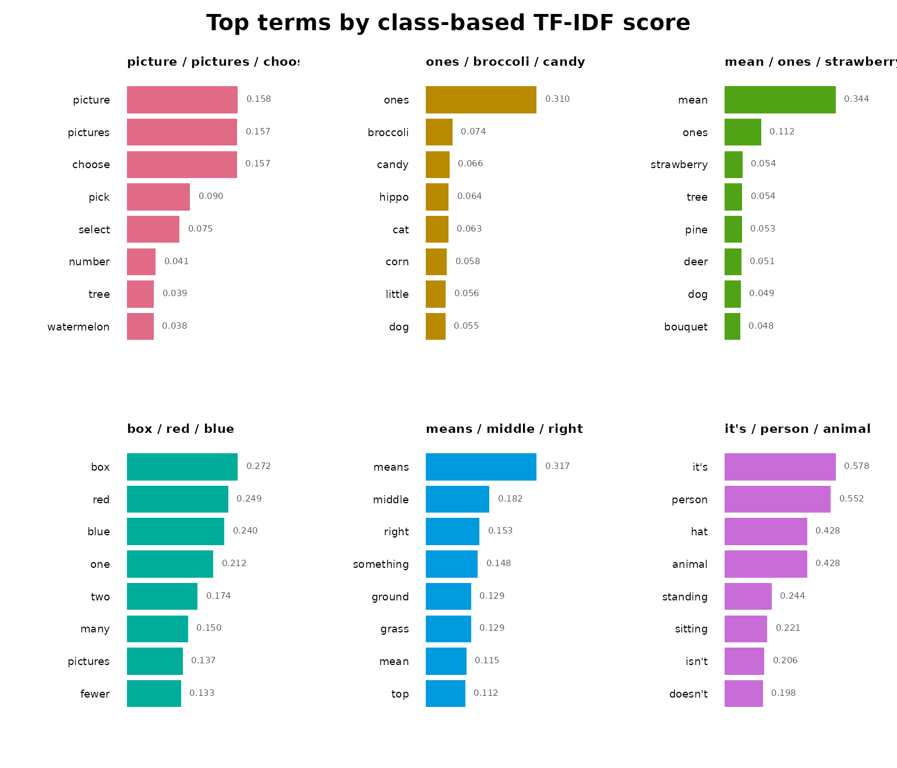
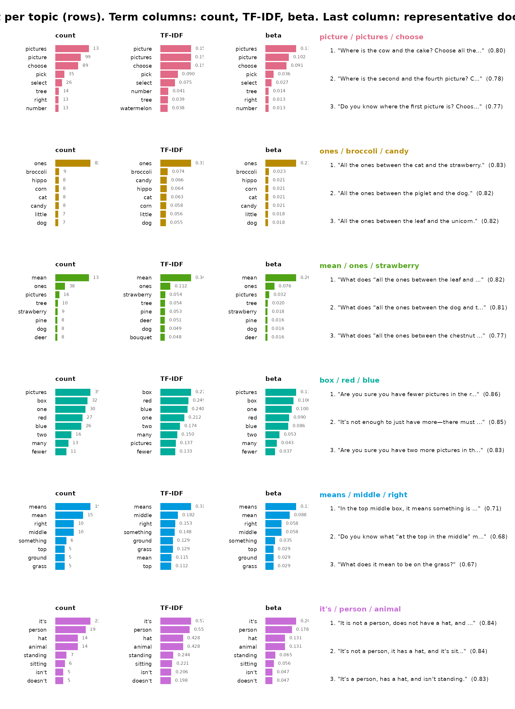
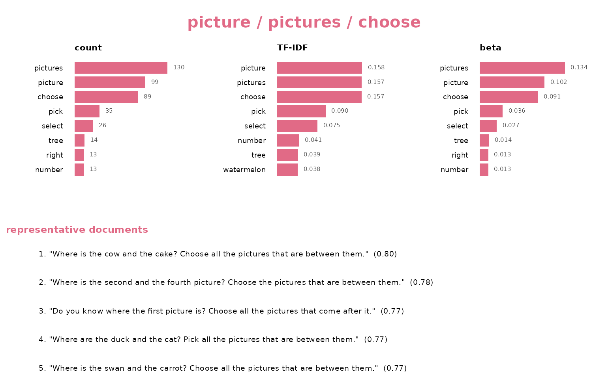

# Semantic Topics in Levebee AI Mathematics Feedback

## Why this tutorial

The `feedback_translations` dataset bundled with **sbert** contains
8,757 AI-generated feedback messages from the Levebee mathematics
application, translated into English from ten source languages. Nobody
can read nearly nine thousand messages, and many repeat verbatim — “Try
again.” is the most common, appearing 11 times — so simple frequency
lists tell you about templates, not content. Topic modeling answers the
question the raw data cannot: *what kind of feedback does the system
actually give, and in what proportions?*

The answer has to survive scrutiny, so every step here is deterministic:
rerunning this document reproduces every number, bar, and sentence
exactly. The tutorial first lets the data choose the number of topics,
builds the resulting six-topic model, and then inspects it from three
deliberately different angles:

1.  **Model quality** — coherence and diversity, so you know which
    topics to trust before interpreting any of them.
2.  **Two keyword views per topic** — raw within-topic counts (what the
    topic *says most*) against class-based TF-IDF (what the topic
    *alone* says). These are different lists by construction, and the
    disagreement between them is itself informative.
3.  **Representative sentences** — the centroid-nearest messages, which
    are the auditable evidence that a topic label means what it claims.

| Component | Verb | Question it answers |
|----|----|----|
| Topic count | [`compare_topics()`](https://sonsoles.me/sbert/reference/compare_topics.md) | How many topics does the corpus support? |
| Topic model | [`topics()`](https://sonsoles.me/sbert/reference/topics.md), [`fitted()`](https://rdrr.io/r/stats/fitted.values.html) | What groups exist? |
| Model quality | [`summary()`](https://rdrr.io/r/base/summary.html), [`coherence()`](https://sonsoles.me/sbert/reference/coherence.md) | Which topics are trustworthy? |
| Topic size | [`topic_sizes()`](https://sonsoles.me/sbert/reference/topic_sizes.md) | How big is each topic, by distinct and reused share? |
| Frequent keywords | `terms(sort_by = "beta")` | What does each topic talk about most? |
| Distinctive keywords | [`terms()`](https://rdrr.io/r/stats/terms.html) | What does each topic talk about that others do not? |
| Evidence | [`representatives()`](https://sonsoles.me/sbert/reference/representatives.md) | Do real messages support the label? |

Fourteen revision-pinned models are available; this tutorial uses the
default, `all-MiniLM-L6-v2` (the field’s standard quality-per-megabyte
English embedder). The menu, with each model’s dimension, input limit,
language coverage, and download size:

``` r

models()
#>                                    model dimensions max_tokens      languages
#> 1                       all-MiniLM-L6-v2        384        256        English
#> 2                      all-MiniLM-L12-v2        384        128        English
#> 3                paraphrase-MiniLM-L3-v2        384        128        English
#> 4              multi-qa-MiniLM-L6-cos-v1        384        512        English
#> 5  paraphrase-multilingual-MiniLM-L12-v2        384        128  50+ languages
#> 6                      all-mpnet-base-v2        768        384        English
#> 7  paraphrase-multilingual-mpnet-base-v2        768        128  50+ languages
#> 8                      bge-small-en-v1.5        384        512        English
#> 9                       bge-base-en-v1.5        768        512        English
#> 10                 multilingual-e5-small        384        512 100+ languages
#> 11                 nomic-embed-text-v1.5        768       8192        English
#> 12           jina-embeddings-v2-small-en        512       8192        English
#> 13                  mxbai-embed-large-v1       1024        512        English
#> 14                        potion-base-8M        256    1000000        English
#>    size_mb
#> 1     90.9
#> 2    133.6
#> 3     69.5
#> 4     90.9
#> 5    479.4
#> 6    436.3
#> 7   1119.2
#> 8    133.8
#> 9    436.5
#> 10   487.4
#> 11   548.0
#> 12   130.5
#> 13  1337.6
#> 14    30.9
```

## The corpus, deduplicated

Embedding the same string twice wastes computation and — more
importantly — lets repeated templates skew the clustering geometry:
every copy of a message like “Try again.” acts as another point pulling
on the same centroid.
[`dedupe()`](https://sonsoles.me/sbert/reference/dedupe.md) collapses
the corpus to its distinct non-blank messages (each kind votes once)
while keeping the row frequencies, which return as weights when sizes
are reported. To keep this tutorial fast and free of any download, it
works with the first 600 distinct messages — drop the
[`head()`](https://rdrr.io/r/utils/head.html) to model the whole corpus:

``` r

corpus <- head(dedupe(feedback_translations$translation), 600)
```

[`model_download()`](https://sonsoles.me/sbert/reference/model_download.md)
is the one step that touches the network. Called without arguments it
fetches the package default, `all-MiniLM-L6-v2` — a 6-layer distilled
English model — as its ONNX graph (90.4 MB) and tokenizer into the local
cache, locked to one immutable Hugging Face revision and refused unless
every byte matches the SHA-256 hashes pinned inside the package, so the
model you run today is provably the model you run next year. To use a
different embedder, pass its name —
`model_download("bge-small-en-v1.5")`, for example — and
[`models()`](https://sonsoles.me/sbert/reference/models.md) lists the
other thirteen pinned options. From there
[`compare_topics()`](https://sonsoles.me/sbert/reference/compare_topics.md)
and [`topics()`](https://sonsoles.me/sbert/reference/topics.md) do the
rest: under the hood they encode each distinct message — tokenized, run
through the network, mean-pooled with padding masked out, and
L2-normalized — into a 600 × 384 matrix, numerically identical to Python
`SentenceTransformers` output and bit-identical on every rerun.

``` r

model_download()
```

## Choosing the number of topics

There is no universally correct number of topics, and **sbert**
deliberately refuses to pick one for you — the right granularity depends
on what the analysis is *for*. Instead of guessing,
[`compare_topics()`](https://sonsoles.me/sbert/reference/compare_topics.md)
fits one model per candidate count and reports the numbers that justify
a choice: coherence (do a topic’s top terms actually co-occur?),
diversity (do topics own their vocabulary or share it?), and the share
of embedding variance `explained`.

``` r

sweep <- compare_topics(
  corpus$text,
  n_topics = c(4, 5, 6, 7, 8, 10, 12),
  measure = "npmi",
  n_representatives = 5
)
sweep
```

    #> <sbert_topic_sweep> 7 candidates, coherence measure: npmi
    #>  n_topics  coherence topic_diversity explained
    #>         4 -0.2070855       0.9250000 0.1229819
    #>         5 -0.1860037       0.9400000 0.1839887
    #>         6 -0.1044246       0.9166667 0.2255144
    #>         7 -0.1894843       0.9142857 0.2355033
    #>         8 -0.1181287       0.9000000 0.2433832
    #>        10 -0.1866628       0.8600000 0.2563262
    #>        12 -0.2138928       0.8151261 0.2716759
    #> 
    #> Fitted models retained: fitted(x, n_topics = 6)

``` r

plot(sweep)
```



Coherence is negative throughout — these are short, template-like
messages, so any two top terms rarely land in the same short string —
but it peaks unmistakably at **six** and falls away on either side,
while diversity stays high and `explained` keeps climbing with the
count. Six is the granularity this corpus actually supports: the point
after which more topics stop buying coherence, and (not by coincidence)
about the number of feedback *kinds* an editorial review can act on.
[`fitted()`](https://rdrr.io/r/stats/fitted.values.html) pulls the
already-fitted six-topic model straight out of the sweep — no
re-encoding, no second clustering:

``` r

topic_model <- fitted(sweep, n_topics = 6)
```

Only
[`model_download()`](https://sonsoles.me/sbert/reference/model_download.md)
and the encoding inside
[`compare_topics()`](https://sonsoles.me/sbert/reference/compare_topics.md)
are skipped here — the 600 messages’ embeddings ship precomputed — so
the vignette builds with no download. Run these lines yourself and you
reproduce every number below exactly.

``` r

topic_model
#> <sbert_topic_model>
#>   documents: 600 
#>   topics: 6
#>   model: precomputed embeddings
#>   algorithm: deterministic k-means (Lloyd)
#>   topic sizes: 223, 133, 131, 49, 37, 27
#>   between/total SS: 22.6%
```

### Should you trust these topics?

Interpretation comes *after* evaluation, because a beautifully labeled
topic with poor coherence is a story about noise. NPMI coherence asks
whether a topic’s top terms actually co-occur in its messages (+1 =
always together, −1 = never); diversity asks whether topics share their
vocabulary or own it.

``` r

summary(topic_model)
#> Semantic topic model summary
#>   documents:            600
#>   topics:               6
#>   model:                precomputed embeddings
#>   between/total SS:      22.6%
#>   mean npmi  coherence:  -0.1044
#>   topic topic_diversity:      0.917 (top 10 terms)
#> 
#>  topic                       label n_documents proportion coherence
#>      1 picture / pictures / choose         223    0.37167   -0.2368
#>      2     ones / broccoli / candy         133    0.22167   -0.4150
#>      3    mean / ones / strawberry         131    0.21833   -0.2564
#>      4            box / red / blue          49    0.08167    0.3011
#>      5      means / middle / right          37    0.06167   -0.2043
#>      6      it's / person / animal          27    0.04500    0.1849
```

``` r

coherence(topic_model, measure = "npmi")
#>   topic                       label measure n_terms  coherence
#> 1     1 picture / pictures / choose    npmi      10 -0.2367956
#> 2     2     ones / broccoli / candy    npmi      10 -0.4150297
#> 3     3    mean / ones / strawberry    npmi      10 -0.2563526
#> 4     4            box / red / blue    npmi      10  0.3010516
#> 5     5      means / middle / right    npmi      10 -0.2043292
#> 6     6      it's / person / animal    npmi      10  0.1849079
```

Carry these numbers into the per-topic panels below: NPMI rewards
regular, repetitive phrasing, so the most template-like topics tend to
score highest, and any topic with visibly lower coherence should be read
through its representative sentences rather than its keywords.

### Size on two scales

The model counts *distinct* messages, but the application sent some
messages many times over, so editorial priority follows the weighted
share, not the distinct share.
[`topic_sizes()`](https://sonsoles.me/sbert/reference/topic_sizes.md)
reports both scales in one call; the gap between `proportion` and
`weighted_share` measures how template-driven each topic is — a topic
whose weighted share far exceeds its distinct share is a small
repertoire of heavily reused messages.

``` r

plot(topic_model, type = "sizes")
```



``` r

topic_sizes(topic_model, weights = corpus$n)
#>   topic                       label n_documents proportion n_weighted
#> 1     1 picture / pictures / choose         223 0.37166667        267
#> 2     2     ones / broccoli / candy         133 0.22166667        162
#> 3     3    mean / ones / strawberry         131 0.21833333        138
#> 4     4            box / red / blue          49 0.08166667         76
#> 5     5      means / middle / right          37 0.06166667         57
#> 6     6      it's / person / animal          27 0.04500000         40
#>   weighted_share
#> 1     0.36081081
#> 2     0.21891892
#> 3     0.18648649
#> 4     0.10270270
#> 5     0.07702703
#> 6     0.05405405
```

## Two keyword views, one topic

`terms(sort_by = "beta")` returns the empirical probability of each word
given the topic — the *generative* view, dominated by whatever the topic
says most often. The class-based TF-IDF scores of
[`terms()`](https://rdrr.io/r/stats/terms.html) (its default `sort_by`)
are the *discriminative* view: they promote words this topic uses and
others do not, and demote words that recur across many topics —
frequent, but saying little about any single one. Neither list is “the”
keywords; a topic is characterized by the pair. When the two lists agree
— as they do for topic 1 below, whose most frequent and most distinctive
words are the same (“picture”, “pictures”, “choose”) — the topic has a
vocabulary of its own; when they disagree, the counts list is telling
you about the corpus and only the TF-IDF list about the topic.

``` r

head(terms(topic_model, n = 8, sort_by = "beta"), 8)
#>   topic                       label     term rank      score frequency
#> 1     1 picture / pictures / choose pictures    1 0.15734447       130
#> 2     1 picture / pictures / choose  picture    2 0.15812657        99
#> 3     1 picture / pictures / choose   choose    3 0.15707789        89
#> 4     1 picture / pictures / choose     pick    4 0.09026252        35
#> 5     1 picture / pictures / choose   select    5 0.07513736        26
#> 6     1 picture / pictures / choose     tree    6 0.03853198        14
#> 7     1 picture / pictures / choose   number    7 0.04088748        13
#> 8     1 picture / pictures / choose    right    8 0.03497847        13
#>         beta
#> 1 0.13360740
#> 2 0.10174717
#> 3 0.09146968
#> 4 0.03597122
#> 5 0.02672148
#> 6 0.01438849
#> 7 0.01336074
#> 8 0.01336074
```

``` r

head(terms(topic_model, n = 8), 8)
#>   topic                       label       term rank      score frequency
#> 1     1 picture / pictures / choose    picture    1 0.15812657        99
#> 2     1 picture / pictures / choose   pictures    2 0.15734447       130
#> 3     1 picture / pictures / choose     choose    3 0.15707789        89
#> 4     1 picture / pictures / choose       pick    4 0.09026252        35
#> 5     1 picture / pictures / choose     select    5 0.07513736        26
#> 6     1 picture / pictures / choose     number    6 0.04088748        13
#> 7     1 picture / pictures / choose       tree    7 0.03853198        14
#> 8     1 picture / pictures / choose watermelon    8 0.03834595        12
#>         beta
#> 1 0.10174717
#> 2 0.13360740
#> 3 0.09146968
#> 4 0.03597122
#> 5 0.02672148
#> 6 0.01336074
#> 7 0.01438849
#> 8 0.01233299
```

## The topics at a glance

`plot(topic_model, type = "terms")` shows each topic’s distinctive
class-based TF-IDF terms, each bar annotated with its score:

``` r

plot(topic_model, type = "terms")
```



`type = "fit"` is the whole per-topic report: all three keyword views —
raw within-topic count, class-based TF-IDF, and generative probability
(beta) — alongside the topic’s centroid-nearest messages, one row per
topic:

``` r

plot(topic_model, type = "fit", n_terms = 8, n_representatives = 3)
```



With `per_topic = TRUE` each topic becomes its own figure, the documents
stacked beneath the terms — easier to read one topic at a time:

``` r

plot(topic_model, type = "fit", per_topic = TRUE, topics = 1)
```



The plot text is clipped to fit; for the full, untruncated evidence
behind each topic, ask for the representatives directly:

``` r

representatives(topic_model, n = 2)
#>    topic rank document_id
#> 1      1    1         169
#> 2      1    2         559
#> 3      2    1         246
#> 4      2    2         202
#> 5      3    1         482
#> 6      3    2         227
#> 7      4    1          10
#> 8      4    2         475
#> 9      5    1          72
#> 10     5    2         325
#> 11     6    1         380
#> 12     6    2         166
#>                                                                                         text
#> 1          Where is the cat and the princess? Choose all the pictures that are between them.
#> 2           Where is the cup and the balloon? Select all the pictures that are between them.
#> 3                                               All the ones between the grape and the tram.
#> 4                                                  All the ones between the fly and the cat.
#> 5                                   What does “all between the plant and the princess” mean?
#> 6                            What does “all the ones between the leaf and the unicorn” mean?
#> 7                             There should be two fewer in the red one than in the blue one.
#> 8                             There should be two fewer in the blue one than in the red one.
#> 9                                “Sitting” means your bottom is on the ground or on a chair.
#> 10 To be on the grass means to stand or lie down on the soft green ground where grass grows.
#> 11                          This is not a person, it doesn’t have a hat, and it is standing.
#> 12                                                If it’s an animal, then it’s not a person.
#>     distance    margin
#> 1  0.2342085 0.3007396
#> 2  0.2850857 0.2922610
#> 3  0.2641428 0.3146493
#> 4  0.2080425 0.3134329
#> 5  0.2518425 0.3209479
#> 6  0.1835523 0.2937963
#> 7  0.1805440 0.5532961
#> 8  0.1838668 0.5515990
#> 9  0.4359726 0.2885570
#> 10 0.4951715 0.2777950
#> 11 0.1748397 0.5275012
#> 12 0.2196640 0.5096887
```

## Where to go from here

The model built here is reusable, not just describable.
[`predict()`](https://rdrr.io/r/stats/predict.html) assigns any new
feedback message to these six topics without refitting;
[`topic_membership()`](https://sonsoles.me/sbert/reference/topic_membership.md)
replaces the hard assignment with graded probabilities when a message
sits between topics. Multi-sentence messages can be modelled sentence by
sentence instead of whole: `segment = "sentence"` on the fitting verbs
splits every message first and fits the topics on the sentences, and
[`compare_topics()`](https://sonsoles.me/sbert/reference/compare_topics.md)
takes several levels at once so the unit is chosen from a table and a
plot, exactly like the count. The fitted sentence model stores each
sentence with its parent message, so
[`topic_gamma()`](https://sonsoles.me/sbert/reference/topic_gamma.md)
returns every message’s topic mixture with no further encoding and
`topic_sizes(by = "document")` counts messages rather than sentences:

``` r

comparison <- compare_topics(
  corpus$text,
  n_topics = c(4, 6, 8),
  segment = c("document", "sentence")
)
plot(comparison)
plot(comparison, type = "fit", n_topics = 6, n_terms = 8, n_representatives = 3)

sentence_model <- fitted(comparison, n_topics = 6, segment = "sentence")
topic_gamma(sentence_model)
topic_sizes(sentence_model, by = "document", weights = corpus$n)
```

When you explore many models on the same corpus — the sweep above, or
several term settings —
[`topic_corpus()`](https://sonsoles.me/sbert/reference/topic_corpus.md)
segments, embeds, and tokenizes the messages once and every fit reuses
that work, so the exploration costs one corpus pass rather than one per
model. For multilingual work on the *source* messages (the `feedback`
column spans ten languages), swap one argument —
`topics(corpus$text, n_topics = 6, model = "paraphrase-multilingual-MiniLM-L12-v2")`
— and the rest of this document runs unchanged.
